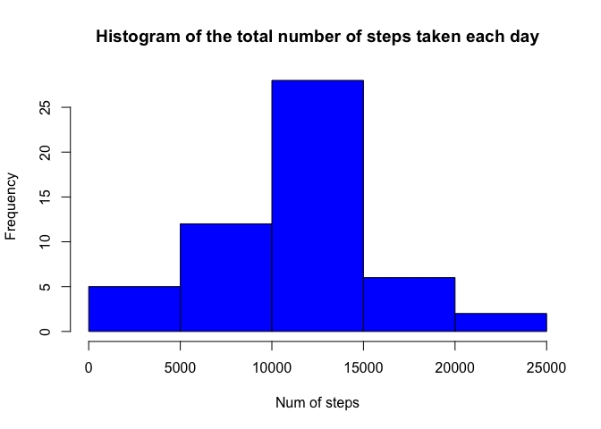
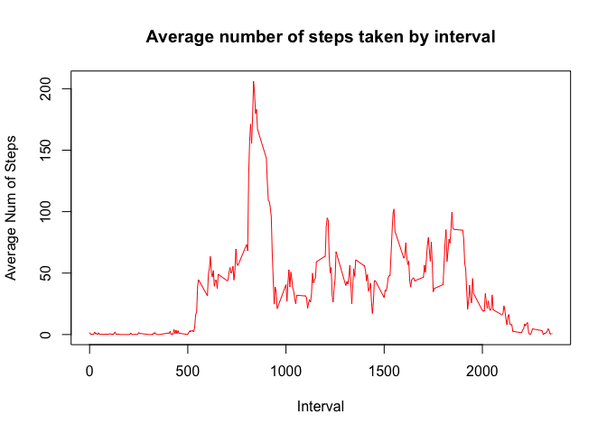
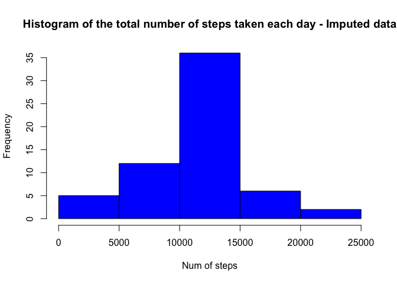
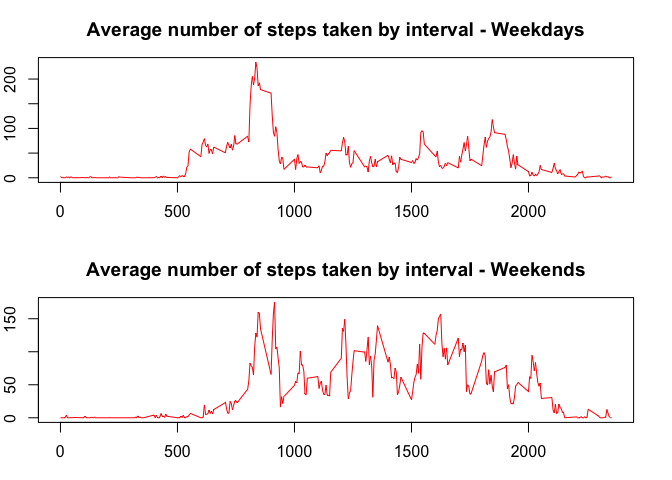

# Reproducible Research

## Course Project 1
## Using R markdown

### Loading and preprocessing the data


```r
setwd("/Users/SaBui/datasciencecoursera")
rm(list = ls())
activity <- read.csv("activity.csv")
activity$date <- as.Date(activity$date)
```

### Histogram of the total number of steps taken each day


```r
library(dplyr)
```

```
## 
## Attaching package: 'dplyr'
## 
## The following object is masked from 'package:stats':
## 
##     filter
## 
## The following objects are masked from 'package:base':
## 
##     intersect, setdiff, setequal, union
```

```r
numstep <- activity %>% group_by(date) %>% summarize (num.step = sum(steps))
hist(numstep$num.step, main = "Histogram of the total number of steps taken each day", col = "blue",
xlab = "Num of steps")
```

 

Mean and median number of steps taken each day

```r
mean(numstep$num.step, na.rm = TRUE)
```

```
## [1] 10766.19
```

```r
median(numstep$num.step, na.rm = TRUE)
```

```
## [1] 10765
```

### Average daily activity pattern
Time series plot of the average number of steps taken


```r
avgstep <- activity %>% group_by(interval) %>% summarize (avg.step = mean(steps, na.rm = TRUE))
plot( avgstep$interval, avgstep$avg.step,type = "l",
main = "Average number of steps taken by interval", xlab = "Interval", ylab = "Average Num of Steps", 
col = "red")
```

 

Which 5-minute interval, on average across all the days in the dataset, contains the maximum number of steps?


```r
avgstep <- avgstep [order(-avgstep$avg.step), ]
ranking <- as.list(avgstep$interval)
ranking[[1]]
```

```
## [1] 835
```
### Inputing missing values
Calculate and report the total number of missing values in the dataset (i.e. the total number of rows with 𝙽𝙰s)


```r
sum(is.na(activity$steps))
```

```
## [1] 2304
```
Code to describe and show a strategy for imputing missing data

For number of steps that are missing, we fill in the
missing information with the mean from the 5-min interval.


```r
activity_imputed <- merge(activity, avgstep, by = "interval", all.x = TRUE)
activity_imputed$steps2 <- ifelse(is.na(activity_imputed$steps) == TRUE, activity_imputed$avg.step, activity_imputed$steps)
```
Histogram of the total number of steps taken each day after missing values are imputed


```r
numstep2 <- activity_imputed %>% group_by(date) %>% summarize (num.step = sum(steps2))
hist(numstep2$num.step, main = "Histogram of the total number of steps taken each day - Imputed data", col = "blue",
xlab = "Num of steps")
```

 
Mean and median number of steps taken each day imputed data

```r
mean(numstep2$num.step, na.rm = TRUE)
```

```
## [1] 10766.19
```

```r
median(numstep2$num.step, na.rm = TRUE)
```

```
## [1] 10766.19
```

Imputing data has little impact on the average number of steps taken. 

### Activity pattern in between weekdays and weekends

```r
activity$day <- weekdays(activity$date)
activity$day <- as.factor(activity$day)
activity_weekdays <- subset(activity, day != "Sunday" & day != "Saturday")
activity_weekends <- subset(activity, day == "Sunday" | day == "Saturday")
avgstep_weekdays <- activity_weekdays %>% group_by(interval) %>% summarize (avg.step.weekdays = mean(steps, na.rm = TRUE))
avgstep_weekends <- activity_weekends %>% group_by(interval) %>% summarize (avg.step.weekends = mean(steps, na.rm = TRUE))
par(mfrow = c(2,1))
par(mar = c(3,2,3,2))
plot( avgstep_weekdays$interval, avgstep_weekdays$avg.step.weekdays,type = "l",
main = "Average number of steps taken by interval - Weekdays", xlab = "Interval", ylab = "Average Num of Steps", 
col = "red")
plot( avgstep_weekends$interval, avgstep_weekends$avg.step.weekends,type = "l",
main = "Average number of steps taken by interval - Weekends", xlab = "Interval", ylab = "Average Num of Steps", 
col = "red")
```

 

